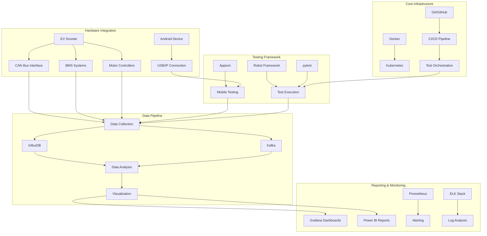

# PVL Testing Architecture

Below is a Mermaid diagram representing the architecture of our Electric Vehicle PVL testing infrastructure.

## Architecture Components Explanation

### Core Infrastructure
- Provides the foundation for all testing activities
- Ensures reproducibility through containerization
- Automates test execution through CI/CD pipelines

### Hardware Integration
- Interfaces with physical EV components
- Captures real-time data from vehicle systems
- Establishes Android device connectivity through USB/IP

### Testing Framework
- Executes automated test cases
- Manages test sequences and dependencies
- Provides specialized mobile testing capabilities

### Data Pipeline
- Collects, processes, and stores test data
- Enables real-time and historical data analysis
- Feeds visualization and reporting systems

### Reporting & Monitoring
- Provides real-time visibility into test execution
- Generates comprehensive test reports
- Alerts on test failures and anomalies