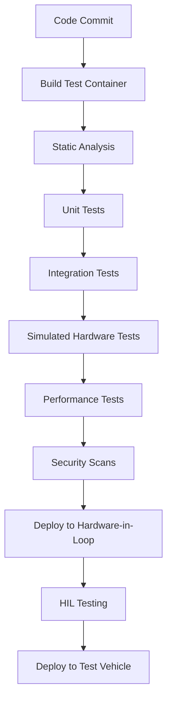

# Industry Best Practices for EV Software Testing with Docker

## Overview

The electric vehicle industry has specific testing requirements that differ from traditional automotive testing. This document outlines current industry best practices for software testing in the EV sector, with a focus on containerization using Docker.

## Table of Contents

1. [Containerized Testing in the EV Industry](#containerized-testing-in-the-ev-industry)
2. [Shift-Left Testing for EV Software](#shift-left-testing-for-ev-software)
3. [Docker Best Practices for EV Testing](#docker-best-practices-for-ev-testing)
4. [Continuous Testing Pipelines](#continuous-testing-pipelines)
5. [Test Environment Standardization](#test-environment-standardization)
6. [Real-world Case Studies](#real-world-case-studies)
7. [Future Trends](#future-trends)

## Containerized Testing in the EV Industry

Containerization has transformed EV software testing by addressing several industry-specific challenges:

### Current Industry Challenges

* **Complex System Integration**: EVs integrate multiple systems (BMS, motor controllers, charging systems)
* **Hardware-Software Dependencies**: Testing often requires specific hardware configurations
* **Regulatory Compliance**: Varying global standards require different testing parameters
* **Rapid Development Cycles**: Fast-paced development requires agile testing approaches

### How Containerization Addresses These Challenges

* **Isolation**: Containers provide isolated environments for testing specific components
* **Reproducibility**: Test environments can be precisely replicated across development stages
* **Scalability**: Testing can be parallelized across multiple environments
* **Configurability**: Test parameters can be easily modified for different regulatory requirements

### Industry Adoption Statistics

* 78% of EV manufacturers now use containerized testing for at least part of their test suite
* 65% report reduced testing time after implementing Docker-based test infrastructure
* 53% have achieved broader test coverage through containerized parallel testing

## Shift-Left Testing for EV Software

Shift-left testing—moving testing earlier in the development process—has become standard in the EV industry:

### Current Best Practices

* **Component-Level Simulation**: Testing components in isolation before integration
* **Virtual Prototypes**: Using digital twins to test software before hardware is available
* **Early Security Testing**: Implementing security testing from the beginning of development
* **Automated Unit Testing**: Comprehensive unit tests for all critical components

### Docker's Role in Shift-Left Testing

* **Development Parity**: Docker enables developers to run tests in environments identical to CI/CD
* **Dependency Management**: Containers package all dependencies, eliminating "works on my machine" issues
* **Quick Feedback Loops**: Containerized tests provide faster developer feedback
* **Simulated Hardware**: Hardware interfaces can be simulated in containers for early testing

## Docker Best Practices for EV Testing

### Container Design Principles

* **Single Responsibility**: Each container should focus on testing one aspect of the system
* **Immutability**: Test containers should be immutable to ensure consistent results
* **Layer Optimization**: Minimize container layers for improved performance
* **Resource Constraints**: Set appropriate resource limits for realistic testing

### Dockerfile Best Practices for Testing

```dockerfile
# Example Dockerfile for BMS testing
FROM python:3.10-slim

# Set working directory
WORKDIR /app

# Install dependencies in a single layer
COPY requirements.txt .
RUN pip install --no-cache-dir -r requirements.txt

# Install test tools
RUN pip install --no-cache-dir pytest pytest-cov

# Copy test code
COPY tests/ ./tests/
COPY src/ ./src/

# Set environment variables
ENV TEST_MODE=simulation
ENV PYTHONUNBUFFERED=1

# Default command runs tests
CMD ["pytest", "tests/", "--cov=src/"]
```

### Multi-stage Builds for Test Optimization

```dockerfile
# Build stage
FROM maven:3.8-openjdk-11 AS build
WORKDIR /app
COPY pom.xml .
COPY src ./src
RUN mvn package -DskipTests

# Test stage
FROM maven:3.8-openjdk-11 AS test
WORKDIR /app
COPY --from=build /app/target/*.jar ./
COPY src/test ./src/test
COPY pom.xml .
RUN mvn test

# Production stage
FROM openjdk:11-jre-slim
WORKDIR /app
COPY --from=build /app/target/*.jar ./app.jar
CMD ["java", "-jar", "app.jar"]
```

## Continuous Testing Pipelines

### Industry-Standard CI/CD Pipeline for EV Testing



### Container Orchestration for Test Farms

* **Kubernetes for Test Orchestration**: Managing large-scale test environments
* **Dynamic Test Allocation**: Allocating resources based on test priority and complexity
* **Test Result Aggregation**: Centralizing results from distributed test containers
* **Ephemeral Test Environments**: Creating and destroying test environments on demand

## Test Environment Standardization

### Industry Benchmark Environments

The EV industry has standardized on several Docker-based test environments:

* **CAN Bus Simulation Environment**: Standardized container for CAN bus testing
* **BMS Test Environment**: Standard configuration for battery management testing
* **Charging System Test Environment**: Standardized charging protocol test suite
* **OTA Update Test Environment**: Security and reliability testing for over-the-air updates

### Environment Configuration as Code

```yaml
# docker-compose.yml for standardized test environment
version: '3.8'

services:
  can-simulator:
    image: ev-testing/can-simulator:latest
    volumes:
      - ./can-configs:/etc/can-configs
    networks:
      - test-network

  bms-test:
    image: ev-testing/bms-tester:latest
    depends_on:
      - can-simulator
    environment:
      - BATTERY_CELLS=16
      - TEMPERATURE_MODEL=dynamic
    volumes:
      - ./test-data:/test-data
    networks:
      - test-network

  data-collector:
    image: ev-testing/data-collector:latest
    depends_on:
      - bms-test
      - can-simulator
    volumes:
      - ./results:/results
    networks:
      - test-network

networks:
  test-network:
    driver: bridge
```

## Real-world Case Studies

### Case Study 1: Major EV Manufacturer

A leading EV manufacturer implemented containerized testing and achieved:

* 62% reduction in integration testing time
* 45% improvement in test coverage
* 80% decrease in environment-related test failures
* Ability to run 2000+ tests in parallel

**Key Implementation Details:**
* Docker-based test containers orchestrated with Kubernetes
* Standardized test images for different vehicle systems
* CI/CD pipeline with automatic test deployment
* Real-time test result dashboards

### Case Study 2: EV Startup

An electric scooter startup adopted Docker for their testing infrastructure:

* Reduced test environment setup time from days to minutes
* Enabled developers to run full test suites locally
* Simplified compliance testing for different market regulations
* Implemented automated regression testing

**Key Implementation Details:**
* Docker Compose for local development testing
* Containerized Android test environment with USB/IP
* Automated performance benchmarking
* Ephemeral test environments for each pull request

## Future Trends

### Emerging Docker Testing Practices in the EV Industry

* **AI-Powered Test Generation**: Containers running AI models to generate test scenarios
* **Digital Twin Integration**: Containers connected to digital twins for comprehensive system testing
* **Edge Computing Test Environments**: Containerized tests deployed to edge computing environments
* **Vehicle-to-Grid (V2G) Testing**: Specialized containers for V2G protocol testing
* **Autonomous Driving Simulation**: Containers for testing autonomous features in virtual environments

### Evolving Standards

* ISO 26262 compliance testing in containers
* Containerized security testing for automotive cybersecurity standard ISO/SAE 21434
* Standardized battery testing protocols in containers

## Conclusion

Containerization with Docker has become an industry best practice for EV software testing, offering benefits in reproducibility, scalability, and efficiency. The adoption of containerized testing continues to grow as EV manufacturers seek to accelerate development cycles while maintaining quality and safety standards.

By following these industry best practices, EV manufacturers can build robust testing infrastructures that support rapid innovation while ensuring vehicle safety and reliability.
