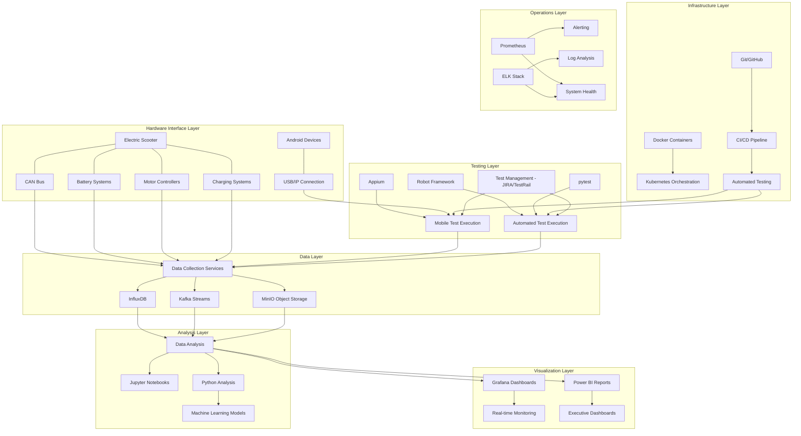
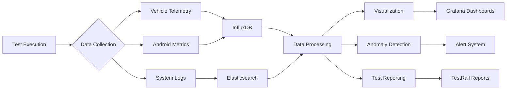
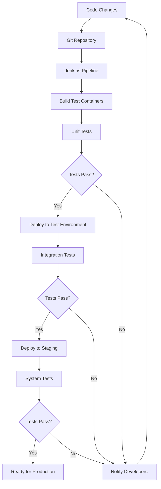
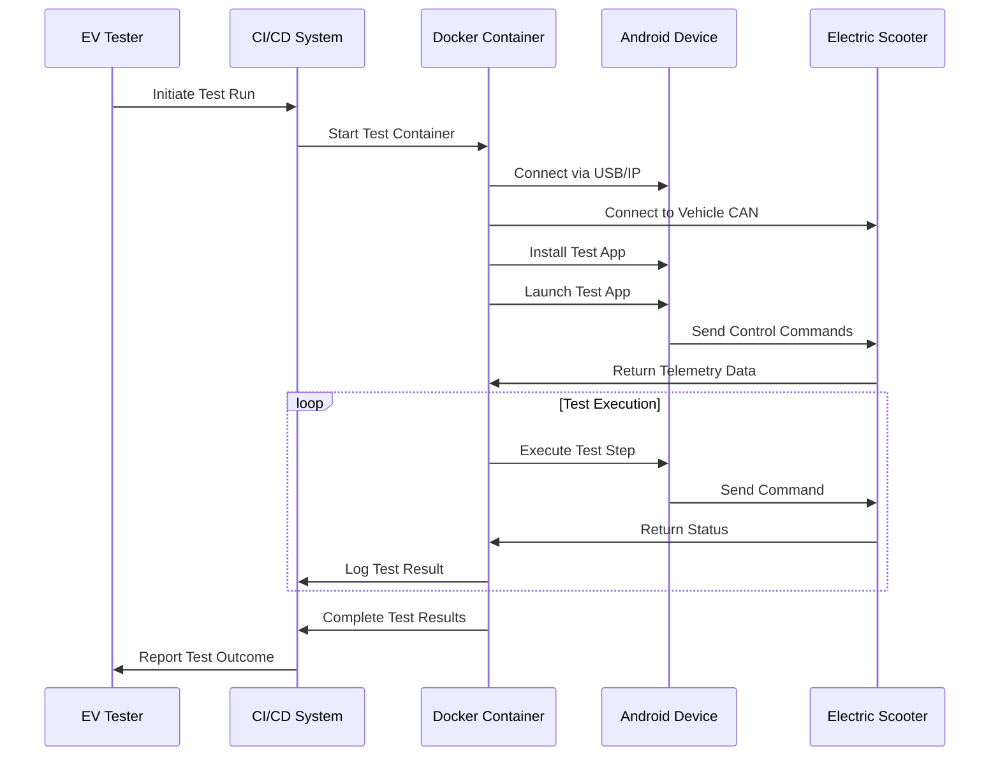

# PVL Tech Stack Mermaid Diagrams

This file contains various Mermaid.js diagrams visualizing the PVL testing infrastructure and workflows.

## Complete System Architecture

## Test Data Flow

## CI/CD Pipeline for Test Automation

## USB/IP Android Testing Workflow

